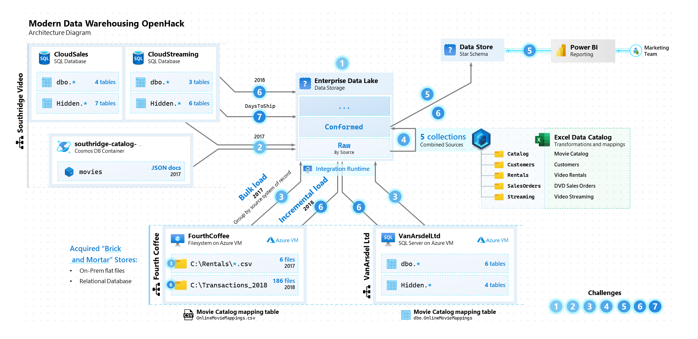

## Challenge 7: Limited release

The team has now extracted data from various sources and integrated it to serve
reports! They’ve even incorporated telemetry and unit testing to assist them in
maintaining high quality. One thing that is still lacking is to automate gated
deployments of new and updated solutions.

### Making the desired change

The team should already have a variety of pipelines and processes in place
to transform the raw source data for downstream consumption.
In this challenge, they are adding one additional column
to the output of the `CloudSales` processing,
such that `TimeToShip = ShipDate - OrderDate`.

### Establishing a dev/test environment

The team has some flexibility here, but the primary goal is that they can
develop and test this new work without impacting the storage they've been
using in previous challenges.
Only when they are confident in their changes
should the "production" resources be updated.

One way to accomplish this would be to create
an additional storage account
and an additional Databricks workspace.
They do not **need** to re-implement the extraction of source data
into their additional storage at this time;
they could take a representative sample from the production lake
and copy that into the dev/test lake for now.

### Validation and Deployment

The team can leverage the resources and skills developed in previous challenges
to automate the validation of `TimeToShip = ShipDate - OrderDate`.
Coaches can encourage teams to test the **calculation logic** in unit tests
that run against the class libraries or modules which produce jars, pip packages, etc.
The team can then validate that this calculation logic is being executed,
and that the **data exists** in the output,
through a more end to end integration test which automates the
execution of a Databricks job.

More detailed guidance on creating deployment pipelines in Azure DevOps or alternative
orchestrators is coming.
In the meantime, lean on the linked references in the challenge text
or collaborate with other coaches.

### Example solution

Below is a diagram generated by [Raki Rahman](mailto:mdrrahman@microsoft.com) as an example solution for the Modern Data Warehouse OpenHack. It can be useful for helping to understand the overall issues and how to work with the data traversal.

